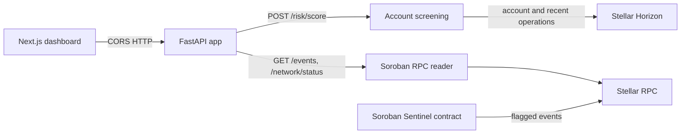

# Stellar Sentinel Backend

[](https://github.com/Stellar-Sentinel/sentinel-backend/actions/workflows/ci.yml)

Read-only FastAPI service for screening Stellar accounts and reading Soroban contract events. It fetches account activity from Horizon, exposes network status and events from Stellar RPC, and does not hold signing keys or submit transactions. Screening scores are transparent heuristics, not proof of fraud or financial/compliance advice. The app reuses a bounded HTTP connection pool for the lifetime of the process and closes it during shutdown.

Screening, network-status, and event routes publish Pydantic response schemas and representative examples in `/openapi.json`. Optional upstream event and ledger fields remain nullable.
Every HTTP response includes `X-Request-ID`. A supplied ID is reused only when it is 1–64 ASCII letters, digits, dots, underscores, or hyphens; otherwise the service generates a UUID and uses the selected value for request correlation.

## Health probes

`GET /health` and `GET /live` are dependency-free liveness checks. `GET /ready` probes the configured Horizon fee-stats endpoint and Soroban RPC health method using `REQUEST_TIMEOUT_SECONDS`. It returns HTTP 200 when both are reachable, or HTTP 503 with a per-dependency `ok`/`unavailable` status when either is degraded. Upstream exception details are not included in the response.

## Architecture



The backend is an event reader, not a transaction writer. The example configuration points to the current Testnet deployment. Set `CONTRACT_ID` to a deployed contract on the selected network; without it, `/events` returns HTTP 503 rather than fabricated data. The service indexes new events into a local SQLite database while running, and `/events` returns the stored history with the existing response fields.

`GET /accounts/{address}/operations?limit=20&cursor=...` returns a page of normalized Horizon operations. The page contains the operation ID/type, creation time, transaction hash, participating accounts, and an `amounts` array. Each amount keeps its own asset type, code, and issuer; path payments may return separate source and destination amounts. `next_cursor` is an opaque token for the following page and is `null` when the current page is short. Page size is limited to 1–100. These values are descriptive activity data and do not alter the risk score.

Request logs are JSON records containing the method, route template, status, latency, and optional request ID. Raw paths, query strings, headers, request bodies, and upstream exception details are not logged; unmatched routes use a fixed label.

### Current Testnet contract

The configured contract is [`CCZAAZ3FJ7LKZA7E7A6EKQTU2HCNVI3YUVIHKWHSULGZSWAJFS2D2XVX`](https://stellar.expert/explorer/testnet/contract/CCZAAZ3FJ7LKZA7E7A6EKQTU2HCNVI3YUVIHKWHSULGZSWAJFS2D2XVX), initialized with threshold `70`. `GET /events` is connected to its Soroban RPC event stream and currently returns an empty event list; no monitoring agent has been authorized yet. See the contract repository's [Testnet deployment runbook](https://github.com/Stellar-Sentinel/sentinel-contracts#testnet-deployment) for transaction links and redeployment commands.

## Project layout

- `app/main.py` — FastAPI app, CORS, and route registration.
- `app/config.py` — environment-backed settings.
- `app/routers/` — health, screening, and event endpoints.
- `app/stellar.py` — Horizon scoring data and Soroban RPC clients/event decoding.
- `app/agents/pipeline.py` — standalone deterministic scoring utility; the HTTP screening route uses live Horizon data through `app/stellar.py`.
- `tests/test_api.py` — mocked API tests; no external chain calls are required.

## Run locally

Requires Python 3.11 or newer.

```bash
python -m venv .venv
source .venv/bin/activate       # Windows PowerShell: .venv\Scripts\Activate.ps1
pip install -r requirements.txt
cp .env.example .env
uvicorn app.main:app --reload
```

Open [http://localhost:8000/docs](http://localhost:8000/docs). Set the frontend's `NEXT_PUBLIC_API_BASE_URL` to this API origin and allow the frontend origin in `CORS_ORIGINS`.

## Commands

| Command | Purpose |
| --- | --- |
| `uvicorn app.main:app --reload` | Run the development API server. |
| `python -m pytest` | Run tests with mocked Horizon and Soroban RPC responses. |

No Python linter is configured in the repository or CI yet. The CI workflow installs `requirements.txt` and runs `python -m pytest`.

## Configuration

Copy `.env.example` to `.env`; environment variables override file values. Use matching Horizon, Soroban RPC, and network passphrase values for one Stellar network.

| Variable | Default | Purpose |
| --- | --- | --- |
| `HORIZON_URL` | `https://horizon-testnet.stellar.org` | Account and operations data source. |
| `SOROBAN_RPC_URL` | `https://soroban-testnet.stellar.org` | Network status and contract event source. |
| `NETWORK_PASSPHRASE` | `Test SDF Network ; September 2015` | Network identifier returned to the UI. |
| `CONTRACT_ID` | Stellar Sentinel Testnet contract | Deployed contract ID for `/events`; use a contract on the configured network. |
| `ENVIRONMENT` | `development` | Runtime environment label. |
| `REQUEST_TIMEOUT_SECONDS` | `8.0` | Outbound HTTP timeout. |
| `UPSTREAM_MAX_RETRIES` | `2` | Number of retries for safe read requests after transient network or HTTP failures; maximum is 3. |
| `UPSTREAM_RETRY_BACKOFF_SECONDS` | `0.2` | Exponential retry backoff base in seconds; maximum is 1. |
| `UPSTREAM_RETRY_AFTER_CAP_SECONDS` | `2.0` | Maximum delay honored from `Retry-After` or computed backoff; maximum is 5 seconds. |
| `OPERATION_SCAN_LIMIT` | `200` | Maximum recent operations examined (Horizon limit is 200). |
| `ACTIVITY_WINDOW_DAYS` | `7` | Recent activity screening window. |
| `RISK_POLICY_VERSION` | `1.0.0` | Semantic version returned with each screening result; bump when scoring semantics change. |
| `RISK_ACTIVITY_BURST_MIN_OPERATIONS` / `RISK_ACTIVITY_BURST_POINTS` | `50` / `25` | Operation-count signal cutoff and points. |
| `RISK_TRANSFER_VOLUME_XLM_THRESHOLD` / `RISK_TRANSFER_VOLUME_POINTS` | `10000` / `25` | Native XLM volume signal cutoff and points. |
| `RISK_COUNTERPARTY_MIN_COUNT` / `RISK_COUNTERPARTY_POINTS` | `20` / `25` | Distinct-counterparty signal cutoff and points. |
| `RISK_LOW_SEQUENCE_MAX` / `RISK_LOW_SEQUENCE_POINTS` | `5` / `15` | Low-sequence signal cutoff and points. |
| `RISK_HIGH_SCORE_THRESHOLD` / `RISK_ELEVATED_SCORE_THRESHOLD` | `70` / `40` | High and elevated risk-level boundaries; high must exceed elevated. |
| `EVENTS_LOOKBACK_LEDGERS` | `50000` | First-page event search window, clamped to RPC retention. |
| `CORS_ORIGINS` | `http://localhost:3000` | Comma-separated browser origins allowed to call the API. |
| `SCREENING_RATE_LIMIT_REQUESTS` | `30` | Maximum account-screening requests per client in the configured window. |
| `SCREENING_RATE_LIMIT_WINDOW_SECONDS` | `60` | Sliding-window length for screening requests. |
| `TRUSTED_PROXY_CIDRS` | empty | Comma-separated IPs/CIDRs of reverse proxies allowed to supply `X-Forwarded-For`. |

Only `POST /risk/score` is rate-limited; health, events, and network status remain available. A client that exceeds its quota receives HTTP 429 with `Retry-After`, `X-RateLimit-Limit`, and `X-RateLimit-Remaining` headers. The limiter uses an in-memory sliding window per application process, so deployments with multiple workers or replicas should enforce a shared limit at their gateway. Forwarded client addresses are used only when the direct peer matches `TRUSTED_PROXY_CIDRS`; configure the exact proxy ranges and ensure the proxy overwrites or appends `X-Forwarded-For` correctly. With no trusted ranges configured, the middleware uses the direct peer address and ignores forwarded headers.
| `EVENT_STORE_PATH` | `./data/events.sqlite3` | SQLite file used for indexed Soroban flag history and the resume cursor. |
| `EVENT_INGEST_INTERVAL_SECONDS` | `30` | Delay between event-indexing polls while the app is running. |

Do not commit `.env`, account secrets, signing keys, or tokens. The current service requires no secrets.

Upstream retry behavior applies only to read-only Horizon requests and Soroban RPC calls. It retries transport errors and selected transient statuses, respects numeric or HTTP-date `Retry-After` values within the configured cap, and leaves client errors and JSON-RPC application errors untouched.

The SQLite database creates `flag_events(scope, event_id, ledger, created_at, agent, subject, score_json, contract_id, tx_hash)` and `ingestion_state(scope, cursor)` automatically. The `(scope, event_id)` primary key makes replay idempotent; scope is the configured network and contract. The service stores the RPC resume cursor and continues after restarts. Back up `EVENT_STORE_PATH` along with application config; deleting or restoring an older database makes ingestion resume from that database's cursor. Local indexed history begins with the RPC provider's current retained window and only preserves events observed after indexing starts; it cannot recover events already pruned upstream. If RPC is temporarily unavailable, `/events` serves indexed records and marks `source.ingestion_status` as `stale`. For multiple application replicas, use one ingestion worker and a supported shared SQLite volume; SQLite is not intended as a network database. Schema is initialized on startup; schema changes should be shipped with explicit migrations.

## Data and scoring limits

The score uses a bounded sample of recent Horizon operations, up to 200, with configurable, validated signal thresholds and weights. Defaults preserve the documented baseline behavior; the final score is capped at 100. It is not a trained model. RPC event history is provider-limited and is not a complete archive. Configure a persistent indexer for long-term event history.

Screening responses include `scoring_policy_version`. Set `RISK_POLICY_VERSION` to a semantic version and bump it when scoring signal meaning or scoring rules change; operational configuration should label any customized policy with its own version.

The `/risk/score` response includes an `assets` array with each Horizon balance and its asset identity, plus `metrics.trustline_count`. Issued-asset balances remain separate from the native XLM balance and do not affect the screening score. Malformed balance records are skipped.
